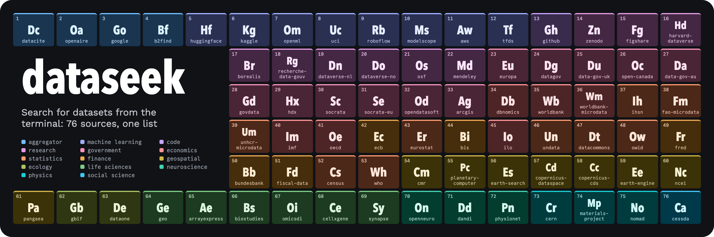

[](https://github.com/lmarkmann/dataseek/actions/workflows/ci.yml) [](https://github.com/lmarkmann/dataseek/releases/latest)

<!-- repo-description -->
Search for datasets from the terminal
<!-- /repo-description -->

Datasets are scattered across dozens of archives: Hugging Face and Kaggle, Zenodo and Dataverse, data.gov and data.europa.eu, the IMF and the ECB, NASA and Copernicus. Each has its own search box, its own idea of relevance, and often its own copy of the same dataset. dataseek covers 76 of them, asks them at once and prints one list: a dataset found in three places shows up once with all three named, and results that several sources agree on, and that match more of your query, rank first.

Most sources need no key and nothing to set up. Results come back in the terminal, as JSON for scripts, or to an AI client over MCP. Google Dataset Search and Mendeley Data are the exception: neither permits automated searches, so dataseek asks them only when you name them with `-s` ([ADR 0013](docs/adr/0013-opt-in-sources.md)). `dsk` is the same program under a shorter name.

## Install

```sh
cargo install --locked --git https://github.com/lmarkmann/dataseek   # installs dataseek and dsk
```

Needs a recent stable Rust toolchain. From a clone, `cargo install --locked --path .` does the same.

## Usage

```sh
dsk search sea surface temperature                 # every default source, merged and ranked
dsk search mnist -s huggingface,kaggle             # only these sources
dsk search inflation -c economics,finance          # only these categories
dsk search census --json | jq -r '.results[].url'  # one URL per line, for scripts
dsk sources                                        # every source, its protocol, key and docs
dsk inspect https://zenodo.org/records/13135140    # a page's metadata and the files it lists
dsk bench                                          # latency and overlap of every source
dsk cache warm                                     # download the catalogs searched locally
```

`dsk search air quality -n 3` on a terminal:

```text
- searching 71 sources for "air quality"; 3 need a key, see `dsk doctor`
1  Improving Indoor Air Quality for Poor Families: Controlled Experiments 2005-2006
   https://microdata.worldbank.org/catalog/396
   worldbank-microdata, ihsn | Susmita Dasgupta, Mainul Huq, M. Khaliquzzaman and David Wheeler | 2...
   Indoor air pollution (IAP) is dangerously high for many poor families in Bangla...

2  Air quality data in five counties in California
   https://b2find.eudat.eu/dataset/f2611e4d-793c-5e55-950c-7a9979c772b8
   b2find, pangaea | PANGAEA | 2026-05-04 | doi:10.1594/pangaea.923005
   Air quality data used to identify time windows of the best air quality in the d...

3  Historical Air Quality
   https://data.calgary.ca/d/uqjm-jxgp
   openaire, socrata | City of Calgary Open Data Portal | 2018-07-16 | See Terms of Use
   This dataset makes historical air quality data accessible for various parameter...

  ✓ 3 of 359 results; 70 of 71 sources answered; -n 359 shows all
```

The first result was listed by both the World Bank and IHSN and appears once. Results go to stdout and the lines around them to stderr, so `dsk search ... > results.txt` keeps only the results.

`dsk` alone shows the commands, `dsk help environment` the variables it reads, `dsk help exit-codes` what it returns. `cargo install` cannot install a man page or completions: `dsk man > ~/.local/share/man/man1/dsk.1` puts the page where `man dsk` finds it, and `dsk completion fish` (or `bash`, `zsh`) says where its script goes.

Most sources need no key. FRED, Roboflow and Data Commons are skipped without their own; keys for Hugging Face, Kaggle, Data.gov, GitHub and NCBI raise limits. See [`docs/reference/keys-and-cache.md`](docs/reference/keys-and-cache.md).

## MCP

`dsk mcp` serves `search`, `sources` and `inspect` to MCP clients that have no shell. Register it in the client's MCP server configuration:

```json
{
  "mcpServers": {
    "dataseek": { "command": "dsk", "args": ["mcp"] }
  }
}
```

Each tool returns what its command prints with `--json`; keys are read from the environment the client starts it in, or from `credentials.toml`. Google Dataset Search and Mendeley Data stay opt-in here too; the model asks for them by naming them in the search tool's `source` argument. [`docs/reference/contract.md`](docs/reference/contract.md#mcp-mode) has the details.

## Development

```sh
just check                            # fmt --check, clippy -D warnings, tests, doctests
just ci                               # everything CI gates on: check, relevance, startup bench, Windows and macOS cross-check, shear, msrv, audit, typos
just audit                            # cargo-deny, zizmor
just run search climate temperature   # the CLI built from this checkout
```

## Docs

- [`docs/CHANGELOG.md`](docs/CHANGELOG.md): what shipped, written by release-plz.
- [`docs/reference/`](docs/reference/): setup, development, the CLI contract, keys and cache, security, and the release loop.
- [`docs/adr/`](docs/adr/): why it is built this way, including [the full source list](docs/adr/0004-every-source-is-searched.md), plus what is [parked](docs/adr/watchlist.md). Read it before proposing an addition.

### Project notes

- [`docs/bench/`](docs/bench/): measured speed of the search stages and of startup, each with the machine it ran on.
- [`docs/synthesis/`](docs/synthesis/): how the sources' search interfaces differ, and the bench that measures them.

## Data sources

dataseek prints each result's publisher and link. When you reuse a dataset, cite or acknowledge its source the way that source asks.

- This product uses the FRED&reg; API but is not endorsed or certified by the Federal Reserve Bank of St. Louis. By using dataseek's `fred` source you agree to the [FRED&reg; API Terms of Use](https://fred.stlouisfed.org/docs/api/terms_of_use.html).
- This product uses the Census Bureau Data API but is not endorsed or certified by the Census Bureau.
- NCBI results come through the E-utilities; NCBI's [disclaimer and copyright notice](https://www.ncbi.nlm.nih.gov/About/disclaimer.html) applies.
- WHO asks that its data be cited as "World Health Organization {YEAR} data.who.int, {ITEM_NAME} [{ITEM_TYPE}]. {URL} (Accessed on {ACCESS DATE})".

## License

Licensed under either of [Apache License, Version 2.0](LICENSE-APACHE) or [MIT license](LICENSE-MIT), at your option.
